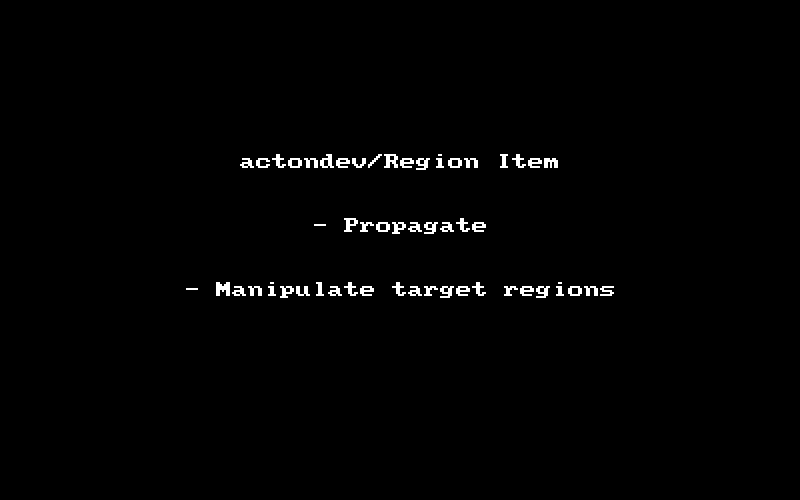
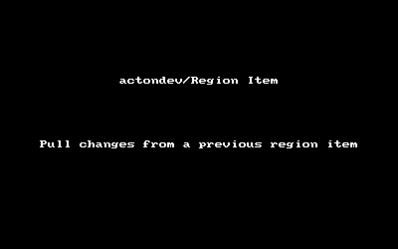
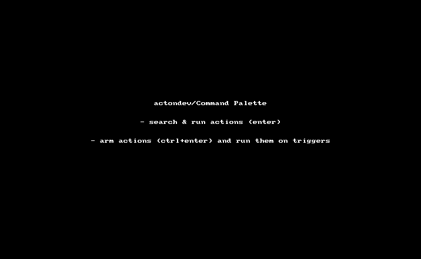

# actondev/Reaper-Scripts v1

See the [changelog](./CHANGELOG.md)

## Region Items

### Propagate changes
Propagate changes to similarly named region items

### Pull changes
Pull changes from a previous region item (that contains this subregion)

## Command Palette

## GUI mini framework
GUI scripts are easy (I hope..) to modify, see [GUI v1](./src/aod/gui)

## Midi item > item arrangements
TBD

## TODOs
 - [ ] insert region item: should disable the 'loop source' option ?
 - [ ] recheck the midi item arrangement
   - item copy bug? if so, post at reaper forum
 - [ ] item arrangement 2 midi
 - [ ] add reapack functionality