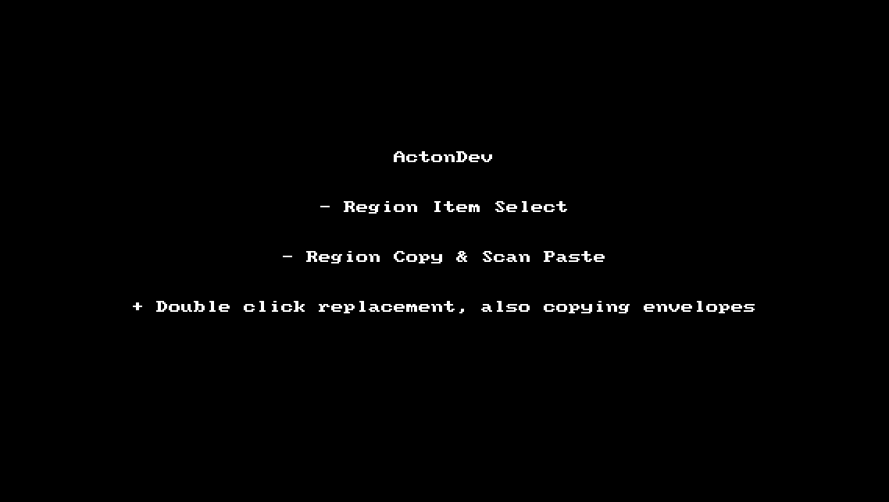

# ActonDev Scripts #

Installation instructions:
Create a folder named "ActonDev" and place these files inside

Example Structure

Directory <Reaper Resources>/Scripts/ActonDev
|   ActonDev_Escape.lua
|   ActonDev_Multi Double Click.lua
|   ActonDev_Region Copy & Scan Paste.lua
|   ActonDev_Region Item Select.lua
|   readme.md
|
\---deps
        class.lua
        region.lua
        template.lua

## List of Scripts##
Regions (Demo http://i.imgur.com/swu4UMv.gif)
    
  + Multi double click (for double clicking item)
  + Region Copy & Scan Paste
  + Region Item Select
  + Escape (multi tool to clear time sel, track sel, item sel PLUS remove temp items created for region copying
Coloring
  + Random Color
  + Color Swatch (customizable, baste on an image swatch)
Other
  + FX Routing Matrix (MAD credits to eugen2777, also to DarkStar for his mod)

## Notes to self ##

Mouse modifiers
---------------
(!! Essential, trust me :D)  *Media item double click*: Multi double click

Keyboard mappings
-----------------
Esc: Escape
`: Folder track toggle Focus
(with alt: custom actions)
Alt+S: Select folder track (useful for multiple, else just use double click)
Alt+C: Copy region
C: Random Color
Shift+C: Color Swatch
Alt+F: Fx Routing Matrix
